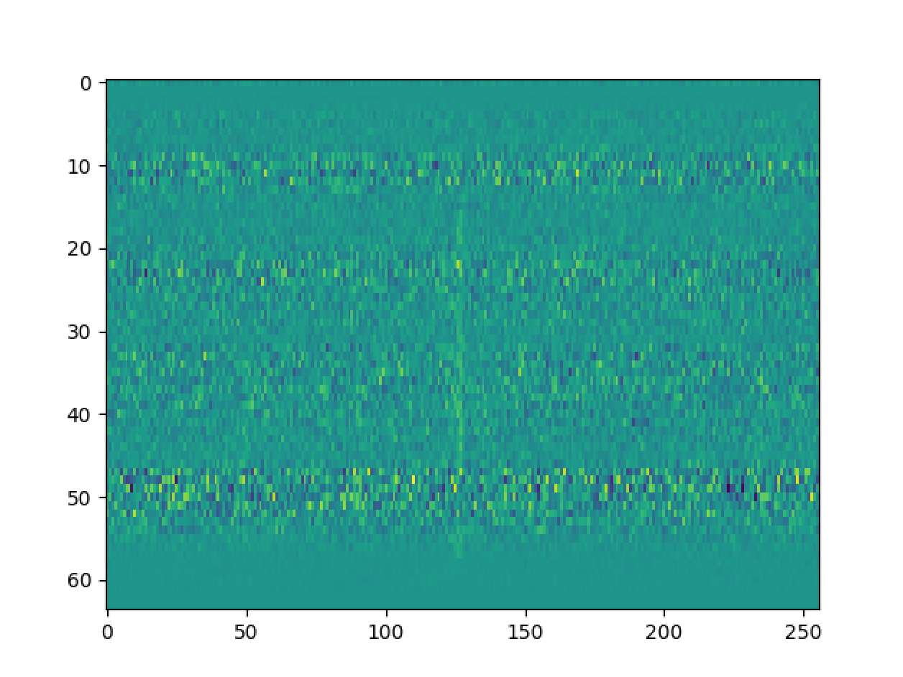

# Fast Radio Burst (FRB) Classification Using the DM vs. Time Plot: Distinguishing FRBs from Radio Frequency Interference)
Kristy Lee, Berkeley SETI Research Center, Fall 2019

## Introduction
Fast radio bursts are transient radio signals that result from high energy, yet to be comprehended astrophysical processes in space; thus there exists the possibility they may be linked to signs of extraterrestrial life, which cause them to be of interest for the Breakthrough Listen program. One distinguishing characteristic of FRBs is that they have a large dispersion measure (DM) in comparison to radio frequency interference (RFI), which I utilize to my advantage in this project. The purpose of my project is to train a convolutional neural network (CNN) model to identify and distinguish the rarely occurring FRBs from noise or RFI -- in two-dimensional images of DM-vs-time. 

## Observation
Any transient broadband signal, traveling through the interstellar medium, encounters dispersion due to free electrons between us and the pulsar. This dispersion manifests as a delay between the arrival time of the signal across observed frequency. If observations are to be conducted across frequencies f_H and f_L, then arrival time difference at respective frequencies can be given as, 

<a href="https://www.codecogs.com/eqnedit.php?latex=(t_H&space;-&space;t_L)&space;\propto&space;DM&space;(\frac{1}{F_L^2}&space;-&space;\frac{1}{F_H^2})" target="_blank"></a>

Here, DM stands for dispersion measure which is a parameter representing average electron density towards the line-of-sight to the pulsar. The below figure shows the example of a dispersed pulse across observed frequencies of 3602.0 and 8400.8 at the DM of 363.0. 

<p align="center">
  
</p>


## Methodology
We can dedisperse the signals as follows: shift the signal at each frequency channel left such that we have collapsed the signal to a single column located at time at <a href="https://www.codecogs.com/eqnedit.php?latex=t_H" target="_blank"></a> by adding a dispersion delay. This is done using the code beneath:

```
dmvstm_array = []
for ii in np.arange(lodm,hidm,dmstep):
        #Without this, dispersion delay with smaller DM step does not produce delay close to bin width
        data.dedisperse(0,padval='rotate')
        data.dedisperse(ii,padval='rotate')
        Data = np.array(data.data[..., :nbinlim])
        Dedisp_ts = Data.sum(axis=0)
        dmvstm_array.append(Dedisp_ts)
        dmvstm_array.append(Dedisp_ts)

return np.array(dmvstm_array)
```

where data corresponds to the image data. Since the DM of the FRB is what distinguishes the FRB from RFI, we can thus train a convolutional neural network to recognize FRBs from RFI through the numerical data collected from dedispersing each signal and classifying each resulting shift as shown in the new DM vs. time plot as either corresponding to an FRB existing in the image or to an insignificant signal/noise (RFI). 

We simulated around 8000 FRBs with a range of DMs and injected them to real-data collected from the Green Bank Telescope at frequencies across 4 GHz to 8 GHz.  We then constructed and passed these 8000 training samples of DM vs. time plots (and their corresponding labels) and 2000 test samples DM vs. time plots (and their corresponding labels) to the neural network to create and train a model that can be used as a predictor of an FRB's presence in DM-vs-time images (such as one shown below).

<p align="center">
  
</p>


## Usage
In the command line, run 

```
bash
python2 build_convNN.py <arg.npz>
```

with the first argument being a .npz file containing an array of Spectra objects (containing frequency vs. time image data relating to the presence of a simulated FRBs) and the classification labels corresponding to the Spectra objects to begin the process of training a convolutional neural network to distinguish between FRBs and RFI. Then, for each Spectra object with a DM of greater than 50, generate its DM vs. time plot through dedispersion and represent the plot as a numpy array. Randomly choose 80% of the DM vs. time plots to use to train the convolutional neural network model, and let the remaining 20% be part of the test set to see whether the model produces the correct predictions or not.

The two outputted files are best_model.h5 and confusion_matrix.png, where best_model.h5 corresponds to the convolutional neural network built and confusion_matrix.png reports the numbers of true positives, false positives, false negatives, and true negatives shown in the shows four plots: the true positive DM vs. time plot that had lowest probability of being classified as containing an FRB, the false-positive DM vs. time plot that had the highest probability of being classified as containing an FRB, the false-negative DM vs. time plot that had the highest probability of being classified as negative, and the true negative DM vs. time plot that had the lowest probability of being classified as negative.


## Current Results

## Acknowledgements
- Vishal Gajjar for mentorship throughout this project
- Dominic LeDuc for working on the project with me and generating simulated FRBs that I used to train the convolutional neural network
- Liam Connor and Joeri van Leeuwen for reference material for research through paper "Applying Deep Learning to Fast Radio Bursts"
- Liam Connor and Joeri van Leeuwen for reference material for research through paper "Applying Deep Learning to Fast Radio Bursts"
- Agarwal et. al. for reference material for research through paper "Towards deeper neural networks for Fast Radio Burst detection"
