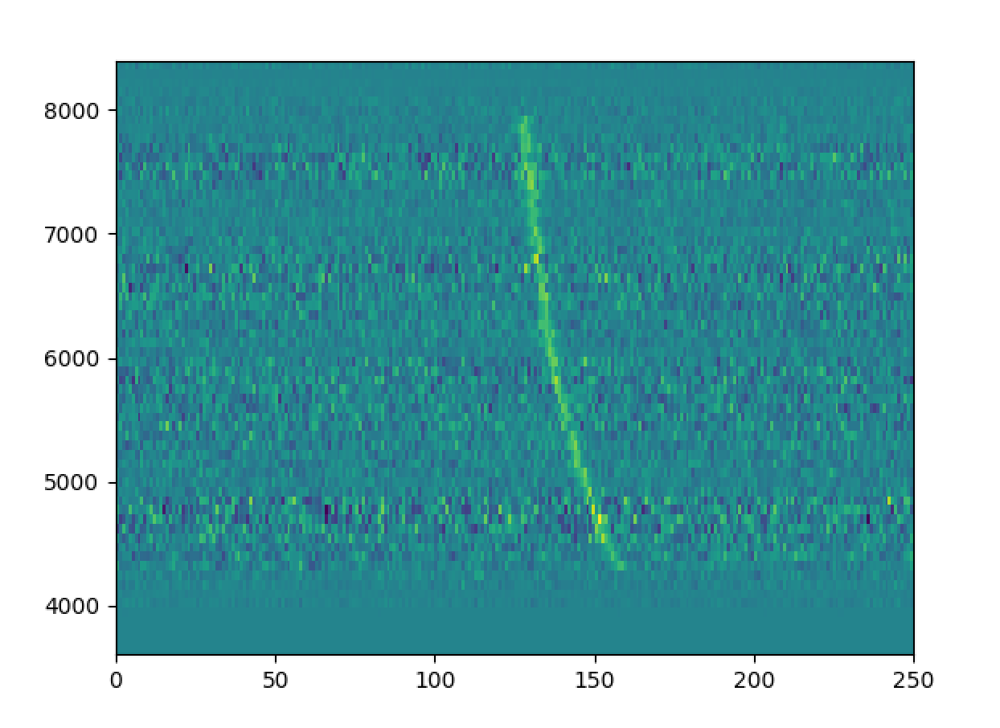
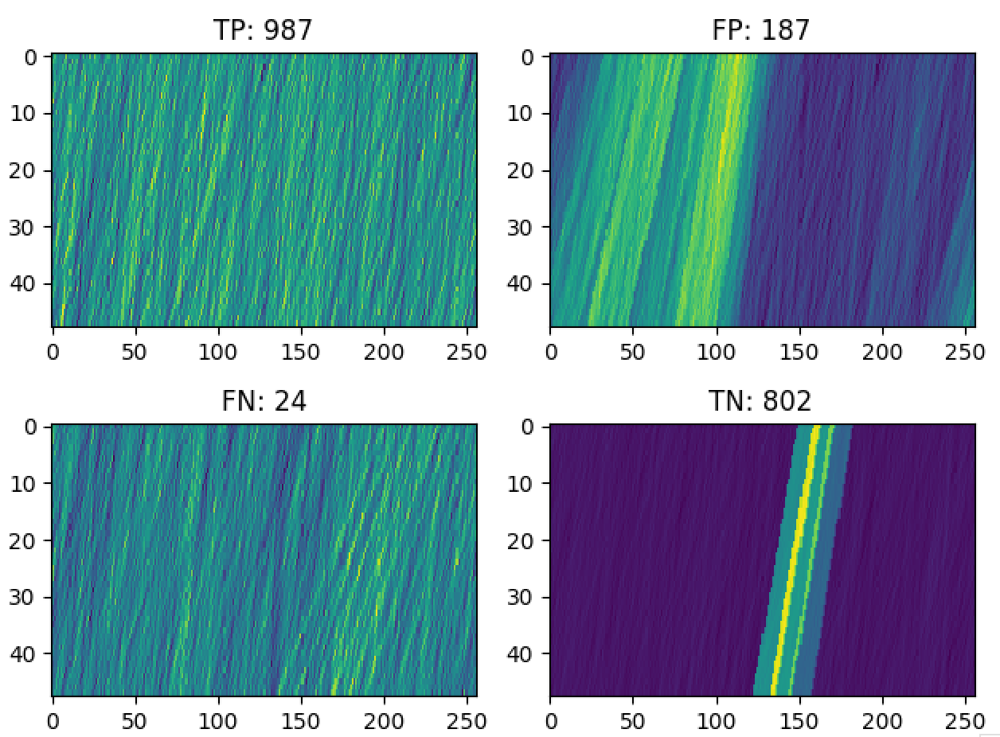

# Fast Radio Burst (FRB) Classification Using DM: Distinguishing FRBs from Radio Frequency Interference
Kristy Lee, Berkeley SETI Research Center, Fall 2019

## Introduction
Fast radio bursts are transient radio signals that result from high energy, yet to be comprehended astrophysical processes in space; thus there exists the possibility they may be linked to signs of extraterrestrial life, which cause them to be of interest for the Breakthrough Listen program. One distinguishing characteristic of FRBs is that they have a large dispersion measure (DM) in comparison to radio frequency interference (RFI), which I utilize to my advantage in this project. The purpose of my project is to train a convolutional neural network (CNN) model to identify and distinguish the rarely occurring FRBs from noise or RFI -- in two-dimensional images of DM-vs-time. 

## Observation
Any transient broadband signal, traveling through the interstellar medium, encounters dispersion due to free electrons between us and the source. This dispersion manifests as a delay between the arrival time of the signal across observed frequency. If observations are to be conducted across frequencies <a href="https://www.codecogs.com/eqnedit.php?latex=_{F_H}" target="_blank"></a> and <a href="https://www.codecogs.com/eqnedit.php?latex=_{F_L}" target="_blank"></a>, then arrival time difference at respective frequencies can be given as, 

<a href="https://www.codecogs.com/eqnedit.php?latex=(t_H&space;-&space;t_L)&space;\propto&space;DM&space;(\frac{1}{F_L^2}&space;-&space;\frac{1}{F_H^2})" target="_blank"></a>

Here, DM stands for dispersion measure which is a parameter representing average electron density towards the line-of-sight to the pulsar. The below figure shows the example of a dispersed pulse across observed frequencies of 3602.0 and 8400.8 at the DM of 363.0. 

<p align="center">
  
</p>

## Methodology
We can dedisperse the signals as follows: shift the signal at each frequency channel left such that we have collapsed the signal to a single column located at time at <a href="https://www.codecogs.com/eqnedit.php?latex=t_H" target="_blank"></a> by adding a dispersion delay. This is done using the code beneath:

```python
dmvstm_array = []
for ii in np.arange(lodm,hidm,dmstep):
        #Without this, dispersion delay with smaller DM step does not produce delay close to bin width
        data.dedisperse(0,padval='rotate')
        data.dedisperse(ii,padval='rotate')
        Data = np.array(data.data[..., :nbinlim])
        Dedisp_ts = Data.sum(axis=0)
        dmvstm_array.append(Dedisp_ts)

return np.array(dmvstm_array)
```

where data corresponds to the image data. Since the DM of the FRB is what distinguishes the FRB from RFI, we can thus train a convolutional neural network to recognize FRBs from RFI through the numerical data collected from dedispersing each signal and classifying each resulting shift as shown in the new DM vs. time plot as either corresponding to an FRB existing in the image or to an insignificant signal/noise (RFI). 

We simulated around 8000 FRBs with a range of DMs and injected them to real-data collected from the Green Bank Telescope at frequencies across 4 GHz to 8 GHz.  We then constructed and passed these 8000 training samples of DM vs. time plots (and their corresponding labels) and 2000 test samples DM vs. time plots (and their corresponding labels) to the neural network to create and train a model that can be used as a predictor of an FRB's presence in DM-vs-time images (such as one shown below).

<p align="center">
  
</p>


## Usage
In the command line, run 

```bash
python2 build_convNN.py --spectra_objects [arg.npz]
```

with the first argument being a .npz file containing an array of Spectra objects (containing frequency vs. time image data relating to the presence of a simulated FRB or just RFI) and the classification labels corresponding to each Spectra object to begin the process of training a convolutional neural network to distinguish between FRBs and RFI. Then, for each Spectra object with a DM of greater than 50, generate its DM vs. time plot through dedispersion and represent the plot as a numpy array. Randomly choose 80% of the DM vs. time plots to use to train the convolutional neural network model, and let the remaining 20% be part of the test set to see whether the model produces the correct predictions or not.

Upon successful training, testing accurate classification of data begins as the following message appears and completes:

```bash
8000/8000 [==============================] - 17s 2ms/step - loss: 1.0584 - acc: 0.6080 - val_loss: 0.6558 - val_acc: 0.6940
 - val_recall: 0.98918387414 - val_precision: 0.626011200996 - val_fscore: 0.967593962711
Epoch 2/32
8000/8000 [==============================] - 16s 2ms/step - loss: 0.7424 - acc: 0.7740 - val_loss: 0.3495 - val_acc: 0.8020
 - val_recall: 0.967551622419 - val_precision: 0.730512249443 - val_fscore: 0.955625280143
...
Epoch 30/32
8000/8000 [==============================] - 16s 2ms/step - loss: 0.1258 - acc: 0.9710 - val_loss: 0.2927 - val_acc: 0.9070
 - val_recall: 0.941002949853 - val_precision: 0.883656509695 - val_fscore: 0.938660027162
fscore (0.9387) did not improve from 0.969
Epoch 31/32
8000/8000 [==============================] - 16s 2ms/step - loss: 0.0823 - acc: 0.9812 - val_loss: 0.3665 - val_acc: 0.9230
 - val_recall: 0.935103244838 - val_precision: 0.915303176131 - val_fscore: 0.934325876663
fscore (0.9343) did not improve from 0.969
Epoch 32/32
8000/8000 [==============================] - 16s 2ms/step - loss: 0.1573 - acc: 0.9685 - val_loss: 0.3521 - val_acc: 0.9220
 - val_recall: 0.936086529007 - val_precision: 0.912751677852 - val_fscore: 0.935166994106
fscore (0.9352) did not improve from 0.969
2000/2000 [==============================] - 1s 457us/step
```

The two new files saved by the program are best_model.h5 and confusion_matrix.png. best_model.h5 contains the convolutional neural network built that can most accurately predict the presence of an FRB inside a Spectra object. confusion_matrix.png reports the numbers of true positives, false positives, false negatives, and true negatives of the test data and shows four plots: the true positive DM vs. time plot that had lowest probability of being classified as containing an FRB, the false-positive DM vs. time plot that had the highest probability of being classified as containing an FRB, the false-negative DM vs. time plot that had the highest probability of being classified as negative, and the true negative DM vs. time plot that had the lowest probability of being classified as negative. This serves to demonstrate example of the most ambiguous data: DM vs. time arrays that are classified as positive or negative with least precision.

Here is an example of a confusion matrix and the corresponding data reported:

```bash
Training on 8000 samples took 8.97 minutes
Confusion matrix:
     995     277
      22     706
accuracy: 0.850500
precision: 0.782233
recall: 0.978368
fscore: 0.869375
```

<p align="center">
  
</p>

Here, 995 of the test items are true positives, 277 of the test items are false positives, 22 of the test items are false negatives, and 706 of the test items are true negatives.

## Current Results
We have successfully developed a convolutional neural network model that can be trained to recognize the difference between an image with an FRB in it and an image with RFI. We have written code to dedisperse each frequency vs. time image of each Spectra object to obtain a DM vs. time array for each, and this is the feature of each Spectra object upon which the neural network will be trained to recognize in order to classify each image as corresponding to an FRB or to RFI. We have trained a model that at 80% accuracy predicts whether a fast radio burst is detected in the Spectra object or not, and consider the model to be a work in progress that has high potential of being further developed and polished to classify Spectra objects with FRBs based on FRB's distinguishing DM characteristic (and hence their DM-vs-time image, data upon which the model was trained). We have also minimized the number of false negatives reported, indicating that the neural network is capable of detecting the presence of FRB among RFI.

## Acknowledgements
- Vishal Gajjar for mentorship throughout this project
- Dominic LeDuc for working on the project with me and generating simulated FRBs that I used to train the convolutional neural network
- Liam Connor and Joeri van Leeuwen for reference material for research through paper "Applying Deep Learning to Fast Radio Burst Classification"
- Agarwal et. al. for reference material for research through paper "Towards deeper neural networks for Fast Radio Burst detection"

